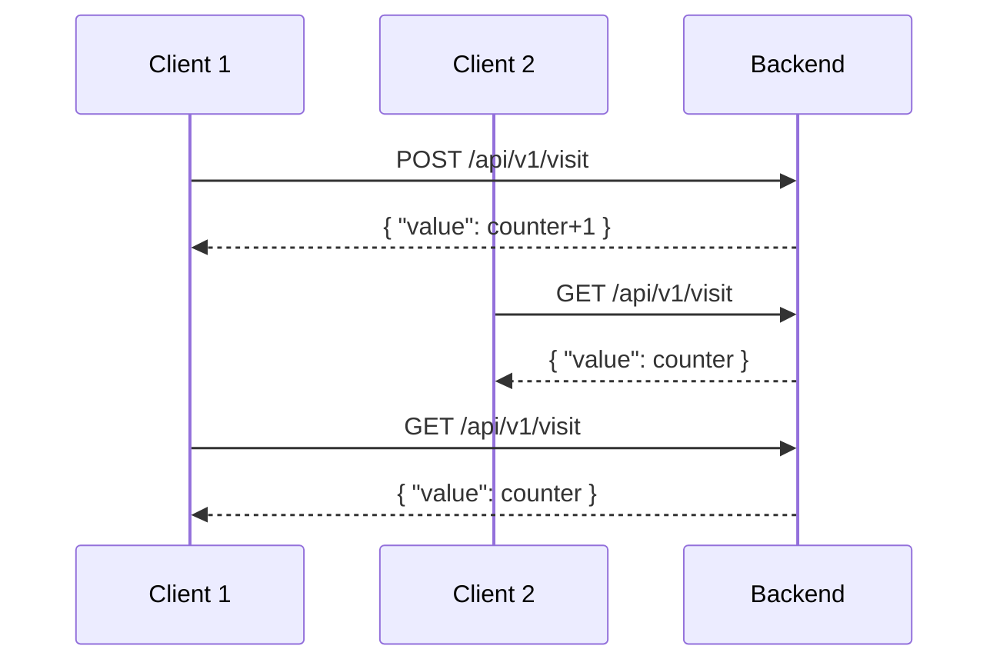

# graph

```mermaid
sequenceDiagram
    participant Client1 as Client 1
    participant Client2 as Client 2
    participant Backend as Backend

    Client1->>Backend: POST /api/v1/visit
    Backend-->>Client1: { "value": counter+1 }

    Client2->>Backend: GET /api/v1/visit
    Backend-->>Client2: { "value": counter }

    Client1->>Backend: GET /api/v1/visit
    Backend-->>Client1: { "value": counter }
```
