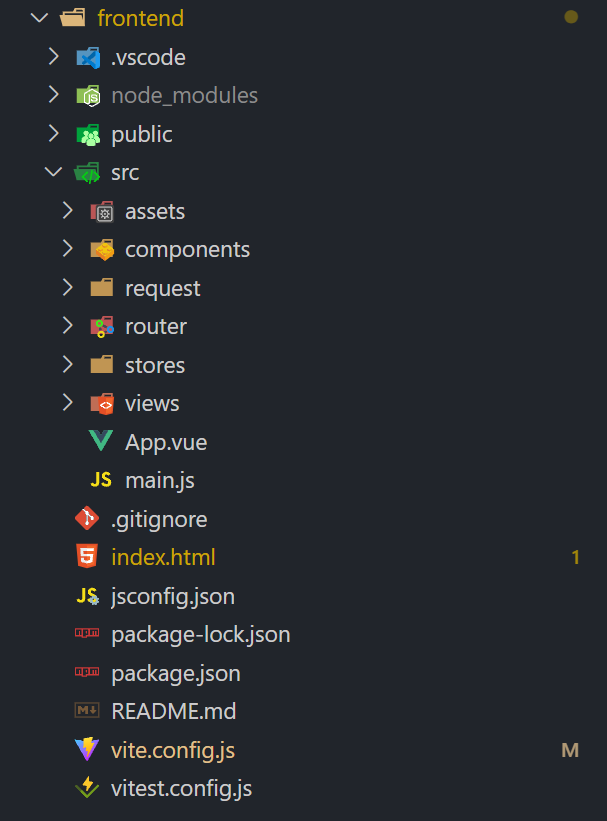

# Vue3入门 : 项目基础

---

- [1. 项目结构](#1-项目结构)
- [2. src](#2-src)
    - [2.1. main.js or main.ts](#21-mainjs-or-maints)
    - [2.2. .vue](#22-vue)
        - [2.2.1. script](#221-script)
        - [2.2.2. template](#222-template)
        - [2.2.3. style](#223-style)

---

## 1. 项目结构

  

- `vite.config.js` : vite配置文件  
    安装插件，配置代理等  
- `package.jso`n & `package-lock.json` : 包管理文件  
- `index.html` : 页面入口文件  
    载入`src/main.js`文件，挂载`App.vue`组件
- `src` : 项目源码目录
    - `main.js` : 项目支撑文件
    - `App.vue` : 项目根组件

---

## 2. src

**基础内容:**  

- `main.js`: 项目支撑文件
- `App`: 项目根组件

**常见构成内容:**  

- `components`: 组件目录
- `assets`: 静态资源目录
- `views`: 视图目录
- `router`: 路由目录
- `store`: 状态管理目录
- `utils`: 工具目录
- `api`: 接口目录
- `styles`: 样式目录

### 2.1. main.js or main.ts

- `createApp`: 创建Vue实例
- `mount`: 挂载到页面上
- `#app`: 挂载点  
    在`index.html`中的`<div id="app"></div>`中挂载  

```js
import { createApp } from 'vue'
import App from './App.vue'

createApp(App).mount('#app')
```

### 2.2. .vue

- `template`(模板): 页面结构
- `script`(脚本): 逻辑处理
- `style`(风格模板): 样式处理

#### 2.2.1. script

```ts
<script lang="ts">
    name: 'Example',
    export default {
        // 数据和方法
        setup() {
            // 数据
            let count = ref(0)
    
            // 方法
            function add() {
                count.value++
            }
    
            // 返回数据和方法
            return {
                count,
                add
            }
        }
    }
</script>
```

- OptionsAPI(选项式API - vue2)  
    使用`this`在内部访问数据和方法  
    - `data`: 数据
    - `methods`: 方法
    - `computed`: 计算属性
    - `watch`: 监听属性  
- CompositionAPI(组合式API - vue3)  
    - name: 组件名称
    - **setup**:  
        对于CompositionAPI，可以使用 **`setup`函数** ，返回数据和方法  
        *P.S. setup会优先于所有的选项式API执行*  
        - `let`: 定义变量
        - `function`: 定义方法
        - `return`: 返回数据和方法

#### 2.2.2. template

```html
<template>
    <div>
        <h1>{{ count }}</h1>
        <button @click="add">Add</button>
    </div>
</template>
```

#### 2.2.3. style

```css
<style>
    h1 {
        color: red;
    },
    .button {
        background-color: blue;
    }
</style>
```
