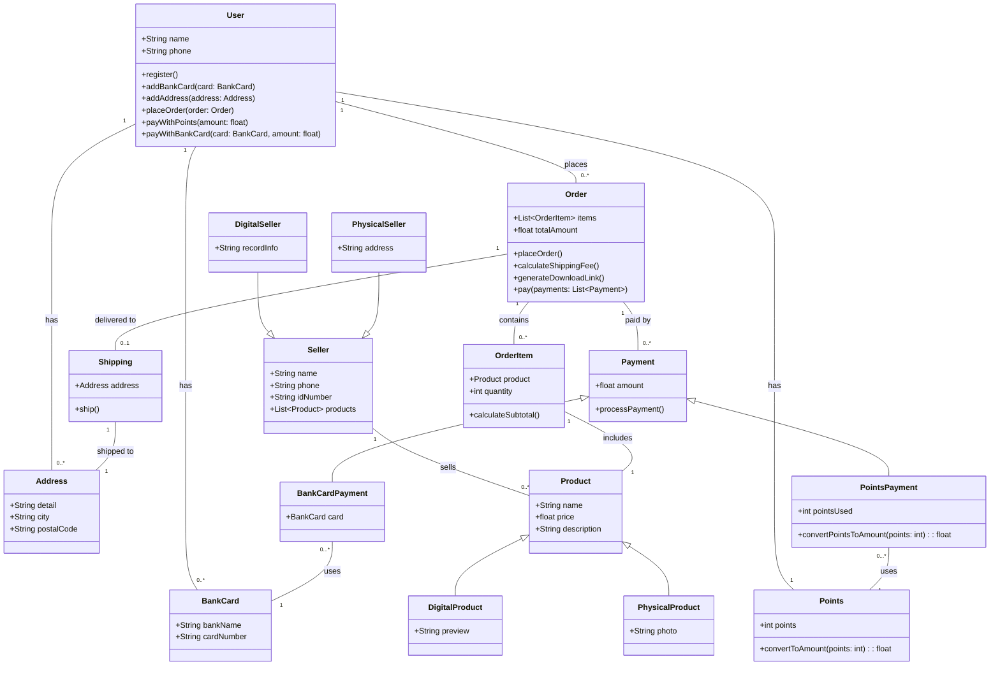

```
classDiagram
    class 用户 {
        +姓名: String
        +手机号: String
        +注册()
        +添加银行卡(银行卡: 银行卡)
        +添加地址(地址: 地址)
        +下单(订单: 订单)
        +积分支付(金额: float)
        +银行卡支付(银行卡: 银行卡, 金额: float)
    }

    class 银行卡 {
        +银行名称: String
        +卡号: String
    }

    class 地址 {
        +详细地址: String
        +城市: String
        +邮政编码: String
    }

    class 积分 {
        +积分: int
        +积分转换为金额(积分: int): float
    }

    class 卖家 {
        +名称: String
        +手机号: String
        +身份证号: String
        +商品列表: List~商品~
    }

    class 数字商品卖家 {
        +备案信息: String
    }

    class 实物商品卖家 {
        +地址: String
    }

    class 商品 {
        +名称: String
        +价格: float
        +描述: String
    }

    class 数字商品 {
        +预览信息: String
    }

    class 实物商品 {
        +商品照片: String
    }

    class 订单 {
        +订单项列表: List~订单项~
        +总金额: float
        +下单()
        +计算运费()
        +生成下载链接()
        +支付(支付方式列表: List~支付方式~)
    }

    class 订单项 {
        +商品: 商品
        +数量: int
        +计算小计()
    }

    class 支付方式 {
        +金额: float
        +处理支付()
    }

    class 积分支付 {
        +使用积分: int
        +积分转换为金额(积分: int): float
    }

    class 银行卡支付 {
        +银行卡: 银行卡
    }

    class 配送 {
        +配送地址: 地址
        +发货()
    }

    %% 关系
    用户 "1" -- "0..*" 银行卡 : 拥有
    用户 "1" -- "0..*" 地址 : 拥有
    用户 "1" -- "0..*" 订单 : 下单
    用户 "1" -- "1" 积分 : 拥有
    卖家 "1" -- "0..*" 商品 : 销售
    数字商品卖家 --|> 卖家
    实物商品卖家 --|> 卖家
    商品 <|-- 数字商品
    商品 <|-- 实物商品
    订单 "1" -- "0..*" 订单项 : 包含
    订单项 "1" -- "1" 商品 : 包括
    订单 "1" -- "0..*" 支付方式 : 支付方式
    支付方式 <|-- 积分支付
    支付方式 <|-- 银行卡支付
    银行卡支付 "0...*" -- "1" 银行卡 : 使用
    积分支付 "0...*" -- "1" 积分 : 使用
    订单 "1" -- "0..1" 配送 : 配送至
    配送 "1" -- "1" 地址 : 发货至
```

