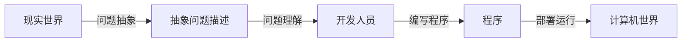

# 软件工程

---

- [1. 概述](#1-概述)
    - [1.1. 软件的概念](#11-软件的概念)
    - [1.2. 软件发展历史](#12-软件发展历史)
        - [1.2.1. 软件产品分类](#121-软件产品分类)
    - [1.3. 软件开发一般过程](#13-软件开发一般过程)
    - [1.4. 如何理解软件工程](#14-如何理解软件工程)
        - [1.4.1. “工程”的基本内涵](#141-工程的基本内涵)
    - [1.5. 软件工程的根本特性](#15-软件工程的根本特性)
    - [1.6. 基本关注点](#16-基本关注点)
    - [1.7. 内容层次](#17-内容层次)
    - [1.8. 根本性困难](#18-根本性困难)
    - [1.9. 系统观与演化观](#19-系统观与演化观)
        - [1.9.1. 系统观](#191-系统观)
        - [1.9.2. 演化观](#192-演化观)
    - [1.10. 软件工程知识体系](#110-软件工程知识体系)
- [2. 软件过程](#2-软件过程)
    - [2.1. 软件过程含义](#21-软件过程含义)
        - [2.1.1. 三层含义](#211-三层含义)
    - [2.2. 软件过程发展历史](#22-软件过程发展历史)
    - [2.3. 软件过程模型（软件开发模型）](#23-软件过程模型软件开发模型)
    - [2.4. 经典软件过程模型](#24-经典软件过程模型)
        - [2.4.1. 瀑布模型](#241-瀑布模型)
        - [2.4.2. 增量模型](#242-增量模型)
        - [2.4.3. 演化模型](#243-演化模型)
        - [2.4.4. 统一过程模型](#244-统一过程模型)
    - [2.5. 软件过程改进](#25-软件过程改进)
    - [2.6. 敏捷过程](#26-敏捷过程)
        - [2.6.1. 敏捷过程的特点](#261-敏捷过程的特点)
    - [2.7. 精益思想](#27-精益思想)
        - [2.7.1. 改进原则](#271-改进原则)
    - [2.8. 敏捷思想与精益思想比较](#28-敏捷思想与精益思想比较)
    - [2.9. 例子](#29-例子)
    - [2.10. 开发运维一体化](#210-开发运维一体化)
        - [2.10.1. 技术价值流与技术实践](#2101-技术价值流与技术实践)
        - [2.10.2. 持续集成（CI）](#2102-持续集成ci)
        - [2.10.3. 持续交付](#2103-持续交付)
        - [2.10.4. 持续部署](#2104-持续部署)
- [3. 版本与开发任务管理](#3-版本与开发任务管理)
    - [3.1. 软件配置管理](#31-软件配置管理)
        - [3.1.1. 主要内容](#311-主要内容)
    - [3.2. 软件项目的持续规划、开发和发布](#32-软件项目的持续规划开发和发布)
    - [3.3. 版本](#33-版本)
        - [3.3.1. 版本发布计划](#331-版本发布计划)
        - [3.3.2. 版本管理](#332-版本管理)
        - [3.3.3. 产品版本号命名](#333-产品版本号命名)
        - [3.3.4. 场景示例](#334-场景示例)
    - [3.4. 版本控制系统](#34-版本控制系统)
        - [3.4.1. 集中式版本控制系统](#341-集中式版本控制系统)
        - [3.4.2. 分布式版本控制系统](#342-分布式版本控制系统)
        - [3.4.3. Git工作流成](#343-git工作流成)
            - [3.4.3.1. Commit](#3431-commit)
            - [3.4.3.2. 代码分支管理](#3432-代码分支管理)
            - [3.4.3.3. 基线管理](#3433-基线管理)
    - [3.5. 特性开发任务](#35-特性开发任务)
        - [3.5.1. 描述](#351-描述)
        - [3.5.2. 管理流程](#352-管理流程)
    - [3.6. 变更管理](#36-变更管理)
        - [3.6.1. 流程](#361-流程)
    - [3.7. 缺陷修复过程管理](#37-缺陷修复过程管理)
        - [3.7.1. 缺陷描述](#371-缺陷描述)
        - [3.7.2. 缺陷追踪系统主要功能](#372-缺陷追踪系统主要功能)
        - [3.7.3. 缺陷修复处理流程](#373-缺陷修复处理流程)
    - [3.8. 基于追踪与回溯的工作量与质量分析](#38-基于追踪与回溯的工作量与质量分析)
        - [3.8.1. 基于追踪的分析](#381-基于追踪的分析)
        - [3.8.2. 基于回溯的分析](#382-基于回溯的分析)
        - [3.8.3. 例子](#383-例子)

---

## 1. 概述

### 1.1. 软件的概念

广义“软件”  

计算机软件  

计算机系统中相对硬件的部分

### 1.2. 软件发展历史

#### 1.2.1. 软件产品分类

应用领域

- 通用
- 定制化

部署和运行形态  

- 信息系统  
- 嵌入式系统

### 1.3. 软件开发一般过程

### 1.4. 如何理解软件工程

软件开发的工程化  

追求：质量、成本、效率

#### 1.4.1. “工程”的基本内涵

过程标准化  

理论和实践支撑

质量有保障

追求实用

### 1.5. 软件工程的根本特性

可靠性  

运行效率  

经济型  

工程  

### 1.6. 基本关注点

质量、成本、时间三角  

以及创新性

### 1.7. 内容层次

“质量”关注点--> 流程--> 方法--> 工具

### 1.8. 根本性困难

软件开发：将问题空间转化为解空间的过工程

根本性困难：

- 不可见的逻辑产品
- 问题空间和解空间的过大差异
- 领域复杂、分布广泛，差异大
- 软件系统的复杂度越来越高

### 1.9. 系统观与演化观

空间维度：系统观

时间维度：演化观

#### 1.9.1. 系统观

软件系统的计算环境以及技术栈

软件系统的物理和社会关系

#### 1.9.2. 演化观

软件系统的持续演化

软件系统的迭代和演化式开发

### 1.10. 软件工程知识体系

SWEBOK  

## 2. 软件过程

### 2.1. 软件过程含义

软件过程：  
定义软件组织和人员在软件产品的定义、开发和维护等阶段中  
所实施的一系列活动和任务  

#### 2.1.1. 三层含义

个体  

整体  

工程  

### 2.2. 软件过程发展历史

### 2.3. 软件过程模型（软件开发模型）

软件过程的结构框架

一定层次上抽象某一类软件过程的共性结构和属性

### 2.4. 经典软件过程模型

- 瀑布模型
- 增量模型
- 演化模型
- 统一过程模型

#### 2.4.1. 瀑布模型

核心思想：过程线性化、顺序化的执行

相对早期软件过程，是一大进步  
但是实际项目很少完全遵循  
切交付太晚，风险大  

#### 2.4.2. 增量模型

开发过程分成若干增量  

每次增量选择部分核心需求作为交付目标，产出可执行中间产品

客户反馈更及时  
相当于以迭代地方式使用瀑布模型

#### 2.4.3. 演化模型

“迭代”以应对不断变化的需求  

典型：螺旋模型  

风险驱动的周期性迭代

原型开发  

- 抛弃式原型
- 增量式原型

#### 2.4.4. 统一过程模型

增量迭代、用例驱动、以体系结构为中心

### 2.5. 软件过程改进

IDEAL软件过程改进模型

计划驱动 vs 敏捷

敏捷：  
充分考虑软件特点，灵活、便于调整

计划：  
传统工程化思维  
稳定、便于协调  

常会有所结合  

### 2.6. 敏捷过程

背景：  
互联网时代

探索：  
共同特点-->拥抱变化  

敏捷宣言

#### 2.6.1. 敏捷过程的特点

需求驱动  

计划都是短期的  

迭代同时强调构造活动  

频繁交付和运行的软件增量  

适应性调整  

**强调适应而非预测**  

12原则

### 2.7. 精益思想

直观理解：  
消除浪费，做有价值的工作  

核心思想：  
在于对系统和开发过程的“持续改善”  
以及“尊重人“  

#### 2.7.1. 改进原则

识别价值  

定义价值流

保持价值流的流动

拉动系统

持续改善

### 2.8. 敏捷思想与精益思想比较

本质同等价值观  

精益思想可以指导敏捷思想

### 2.9. 例子

敏捷实践方法论：

Scrum

XP（极限编程）

看板方法（Kanban）

开发运维一体化（DevOps）

### 2.10. 开发运维一体化

DevOps：  
倡导以移动安全、快速、持续的方式将代码变更部署到生产环境中

#### 2.10.1. 技术价值流与技术实践

技术价值流  

技术实践  

#### 2.10.2. 持续集成（CI）

Continuous Integration

实践：  

开发人员频繁将代码变更提交合并到中央存储库  

自动构建、执行大院测试  

确保可以和原有代码正确集成  

如果失败就要立即进行修复

目标：  

是正在开发的软件始终处于可工作状态  

更快发现、定位和解决问题  

提高软件质量，并减少验证和发布新软件所需时间  

#### 2.10.3. 持续交付

Continuous Delivery

代码变更提交后：

自动构建和执行单元测试  

自动将所有代码编程部署到测试环境和类生产环境  

以确保代码变更可以被正确部署到生产环境  

如果确认无误，可以继续手工部署到生产环境中  

#### 2.10.4. 持续部署

Continuous Deployment

代码变更提交后：

自动构建和执行单元测试  

自动将所有代码编程部署到测试环境和类生产环境  

实现从代码变更提交到生产环境部署的全程自动化而无需人工干预  

## 3. 版本与开发任务管理

软件配置管理：

- 开发任务管理
- 版本管理

### 3.1. 软件配置管理

各种软件制品

变更不可避免，新的版本不断产生

软件开发自身也经常是增量和迭代的

**配置管理：**  
确保软件开发和编程有序进行并向客户发布正确的产品版本的一整套管理方法和工具

#### 3.1.1. 主要内容

版本管理

开发任务管理

构建管理

发布管理

### 3.2. 软件项目的持续规划、开发和发布

持续开展项目的规划、开发与发布

### 3.3. 版本

#### 3.3.1. 版本发布计划

明确版本定位、目标、商业价值等

估算工作量及优先级

分配

创建版本发布计划

#### 3.3.2. 版本管理

任务：  

将各种软件制品都置于系统行的管理之中，进行版本标识  

追踪演化历史  

确保开发人员并行写作开发不会相互影响  

#### 3.3.3. 产品版本号命名

格式：

`M.S.F.B([SP][C])`

- M：主版本号
- S：次版本号
- F：特性版本号
- B：编译版本号
- SP：补丁包版本号
- C：补丁版本号

*\[\]表示可选字段*  

#### 3.3.4. 场景示例

1. 代码演化历史跟踪

2. 历史版本回退

3. 多人开发协作冲突

4. 代码质量检察

### 3.4. 版本控制系统

实现代码版本管理目标的一种有效途径

两种类型：

- 集中式  
- 分布式

#### 3.4.1. 集中式版本控制系统

使用方法：  

开始时，先从服务器拉取工作文件最新版本

完成后，再将更新提交到服务器

因此客户端机器只存储所拉取的文件快照  

代表：  

CVS、SVN

缺点：

联网才能工作  

服务器单点故障会影响整个团队

容易发生版本数据丢失

逐渐被取代

#### 3.4.2. 分布式版本控制系统

使用方法：

每个开发人员维护自己的本地版本库（克隆）  

完成工作后可以将更新提交到本地版本库  

客户端机器存储着完整的版本库

代表：

Mercurial、Git

优点：

无需联网工作

版本数据可以从任何本地库恢复

灵活、强大的分支管理

#### 3.4.3. Git工作流成

1. clone

2. commit

3. pull

4. push

5. checkout

6. add

7. reset

##### 3.4.3.1. Commit

提交  

原子性  

##### 3.4.3.2. 代码分支管理

用于支持多个并行的互不干扰的分支

常用分支类型：

- master: 主分支，用于发布
- develop: 开发分支
- feature: 功能分支
- release: 发布分支，为版本发布做好准备
- hotfix: 补丁分支

分支合并：

发生合并冲突的文件中表基础不同分支中的内容  

开发人员之间对合并冲突进行协商

##### 3.4.3.3. 基线管理

一个分支：一条Codeline（代码线）

一条代码线的上级成为Baseline（基线）

Mainline（主线）：没有基线的代码线

版本管理就是管理这三者的过程

### 3.5. 特性开发任务

#### 3.5.1. 描述

特性：可以给客户带来价值的产品功能

一个特性可以分解为多个用户故事

用户故事：从用户角度对产品功能的详细描述

e.g.

一卡通系统

特性：

- 食堂就餐
- 图书管理
    用户故事：
    - 现场借阅图书
    - 现场归还图书
    - 在线预借图书

#### 3.5.2. 管理流程

开发任务流程管理

交流与沟通

### 3.6. 变更管理

软件开发过程的变更几乎总是无法避免

开发人员不可以随意进行软件变更  
避免引发技术或杨业问题  

需要规范、系统、可控的方式管理软件变更流程

需要 **规范性** 和 **可追踪性**  

#### 3.6.1. 流程

提交变更申请

变更决策

变更的实施与跟踪

变更归档

### 3.7. 缺陷修复过程管理

软件开发和使用过程中经常可以发现缺陷

需要提交缺陷报告（问题单）并进行跟踪

需要实现缺陷修复的有效管理与追踪  
否则容易混乱

#### 3.7.1. 缺陷描述

常用缺陷追踪系统：

JIRA、Bugzilla

#### 3.7.2. 缺陷追踪系统主要功能

缺陷修复流程管理

缺陷交流与沟通

代码管理

#### 3.7.3. 缺陷修复处理流程

### 3.8. 基于追踪与回溯的工作量与质量分析

目的：  
改进软件开发与流程管理过程，以提升软件开发质量

#### 3.8.1. 基于追踪的分析

#### 3.8.2. 基于回溯的分析

#### 3.8.3. 例子

1. SIPOC分析方法
2. 鱼骨图分析方法
3. 5why分析方法
